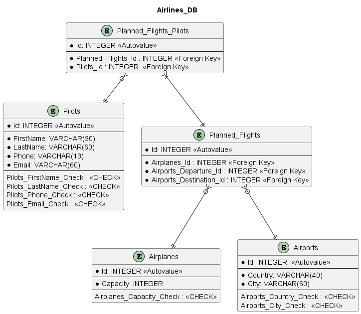

# Специфікація БД

Створити базу даних для авіакомпанії в ПЗ LibreOffice Base.

Авіакомпанія потребує збереження наступних даних:

- літаки
- пілотів
- аеропорти
- заплановані польоти:

    - пілоти
    - літак
    - аеропорт відправлення
    - аеропорт призначення

Діаграма сутностей для БД (ER Diagram) виглядає наступним чином:



Код SQL для створення обмежень `CHECK`:

```SQL
Airplanes_Capacity_Check CHECK (Capacity > 5 AND Capacity < 300)

Pilots_FirstName_Check CHECK (
    LEN(FirstName) > 2 AND
    FirstName NOT LIKE '%[^A-Za-z\-]%' AND
    FirstName NOT LIKE '\-%' AND
    FirstName NOT LIKE '%\-'
    ESCAPE '\')

Pilots_LastName_Check CHECK (
    LEN(LastName) > 3 AND
    LastName NOT LIKE '%[^A-Za-z\-]%' AND
    LastName NOT LIKE '\-%' AND
    LastName NOT LIKE '%\-'
    ESCAPE '\')

Pilots_Phone_Check CHECK (
    LEN(Phone) > 9 AND
    Phone NOT LIKE '%[^0-9\+]' AND
    Phone LIKE '\+%' AND
    Phone NOT LIKE '%[0-9]\+%'
    ESCAPE '\')

Pilots_Email_Check CHECK (
    LEN(Email) > 3 AND
    Email LIKE '%_@__%.__%' AND
    Email NOT LIKE '[^a-z\_\-.]'
    ESCAPE '\')
```

